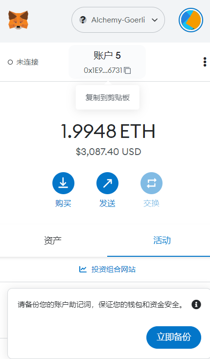

## 1.安装Metamask、并创建好账号



## 2.执行一次转账


在测试网中的交易hash[0xfbb1ef0814c96fed76acf98fc6cffbb5452968aabd1965d47f52126b380277c1](https://goerli.etherscan.io/tx/0xfbb1ef0814c96fed76acf98fc6cffbb5452968aabd1965d47f52126b380277c1)

## 3.使用Remix 创建一个Counter合约并部署：
    Counter合约有一个add(x)方法;

``` solidity
// SPDX-License-Identifier: MIT
pragma solidity ^0.8.0;

contract Counter {
    uint public counter;

    constructor() {
        counter = 0;
    }

    function count() public {
        counter = counter + 1;
    }

    function add(uint x) public {
        counter = counter + x;
    }
}
``` 


合约部署的hash为0x9fc248571ea3d05c49f45a3c61d98caf772b9d7294528f17bf403c5aff6d7b54