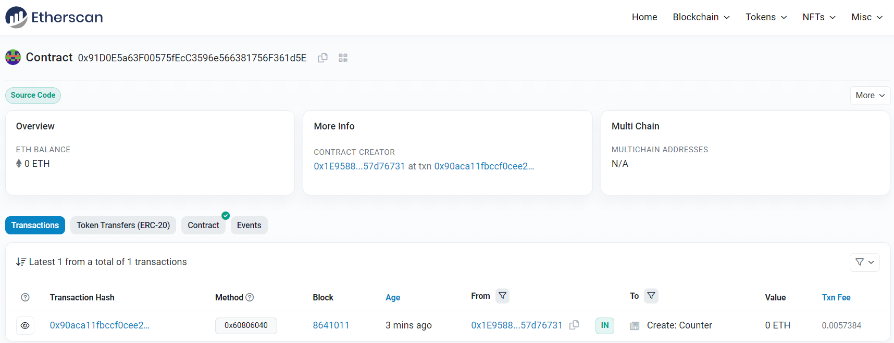
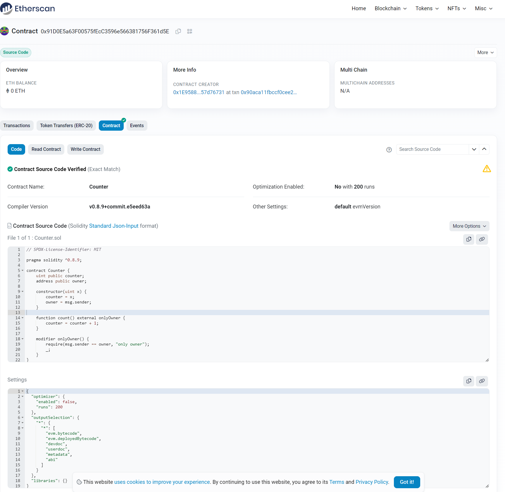

## 1.修改Counter合约，仅有合约部署者可以调用count();

``` solidity
// SPDX-License-Identifier: MIT

pragma solidity ^0.8.0;

contract Counter {
    uint public counter;
    address public owner;

    constructor() {
        counter = 0;
        owner = msg.sender;
    }

    function count() external onlyOwner {
        counter = counter + 1;
    }

    modifier onlyOwner() {
        require(msg.sender == owner, "only owner");
        _;
    }
}


```

## 2.使用Hardhat部署修改后的Counter

```
PS E:\code\coding\UpchainCamp2\w1-2> npx hardhat run --network goerli .\scripts\deploy.js       
counter deployed to: 0x91D0E5a63F00575fEcC3596e566381756F361d5E
```



合约地址
[0x91d0e5a63f00575fecc3596e566381756f361d5e](https://goerli.etherscan.io/address/0x91d0e5a63f00575fecc3596e566381756f361d5e)


## 3.使用Hardhat测试Counter

```
PS E:\code\coding\UpchainCamp2\w1-2> npx hardhat test .\test\Counter.js


  Counter
counter:0x5FbDB2315678afecb367f032d93F642f64180aa3
    ✔ owner call (50ms)
    ✔ other call (58ms)


  2 passing (2s)
```

## 4.代码开源到区块链浏览器

```
PS E:\code\coding\UpchainCamp2\w1-2> npx hardhat verify --network goerli 0x91D0E5a63F00575fEcC3596e566381756F361d5E 0
Nothing to compile
Successfully submitted source code for contract
contracts/Counter.sol:Counter at 0x91D0E5a63F00575fEcC3596e566381756F361d5E
for verification on the block explorer. Waiting for verification result...

Successfully verified contract Counter on Etherscan.
https://goerli.etherscan.io/address/0x91D0E5a63F00575fEcC3596e566381756F361d5E#code
PS E:\code\coding\UpchainCamp2\w1-2> npx hardhat test .\test\Counter.js 

```

