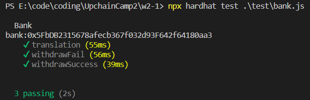

## 1.编写Bank合约

## 2.编写测试脚本
    参考一位前辈的代码，学习了测试脚本的基本框架

    

## 3.部署合约
[https://goerli.etherscan.io/address/0xEf33C5B1d50cBB5A175f0Aa72C0f04D449c75c33](https://goerli.etherscan.io/address/0xEf33C5B1d50cBB5A175f0Aa72C0f04D449c75c33)

